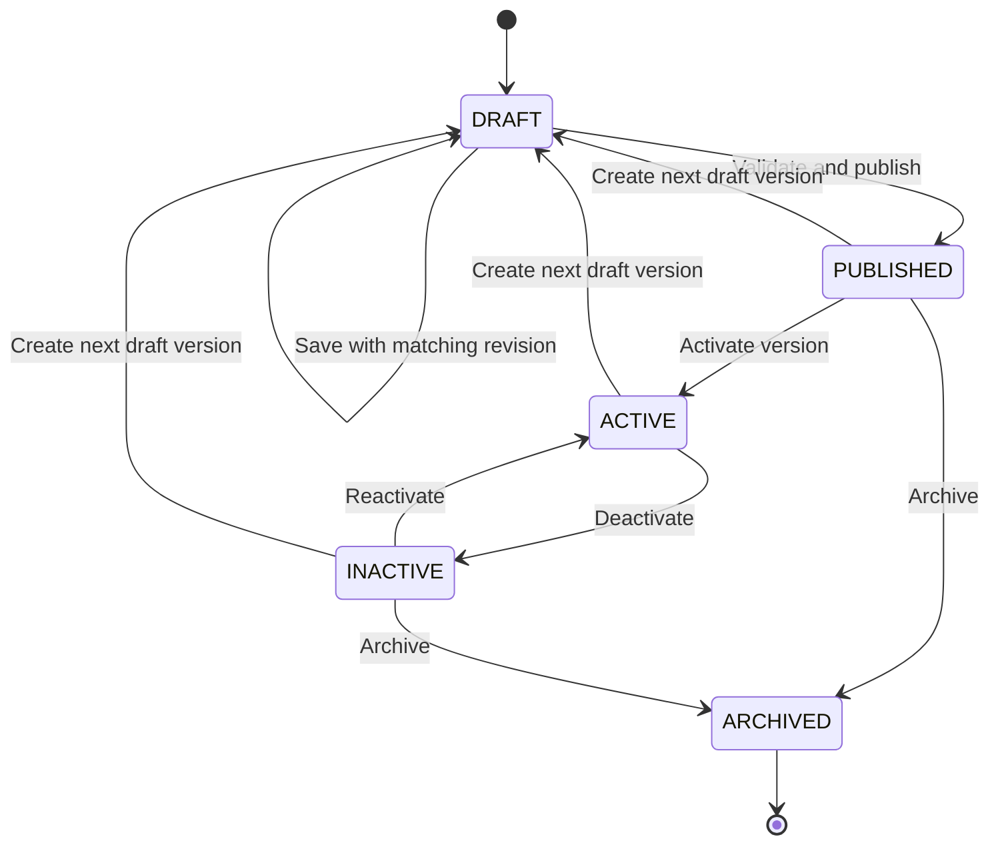

# Workflow Lifecycle

## Invariants

1. Published graph JSON is immutable.
2. Every save includes the draft revision last read by the client.
3. A revision mismatch returns `DRAFT_CONFLICT` and does not overwrite either copy.
4. Publish runs shape validation, graph validation, catalog validation, permission validation, and limit validation.
5. Activation references one explicit published version.
6. Executions retain the version ID they started with even when another version is activated.
7. Archiving an execution version is prohibited while its workflow is active or an execution is running.

## Publish transaction

1. Load the draft and verify its revision.
2. Parse and validate the versioned workflow document.
3. Verify node handlers and configured record/search allowlists.
4. Create an immutable workflow-version record.
5. Link the workflow to the published version.
6. If linking fails, delete the unlinked version as compensating cleanup.
7. Return the published version ID and correlation ID.

## Activation transaction

1. Verify the version belongs to the workflow and is published.
2. Validate trigger bindings against the current account configuration.
3. Deactivate the prior active version for the same binding.
4. Activate the requested version and bindings.
5. Write an administrative audit event.

## Execution states

`QUEUED -> RUNNING -> SUCCEEDED | FAILED | CANCELLED`

A retry creates a new execution only for a retryable failed execution. Duplicate delivery of the same trigger idempotency key resolves to the existing execution.
